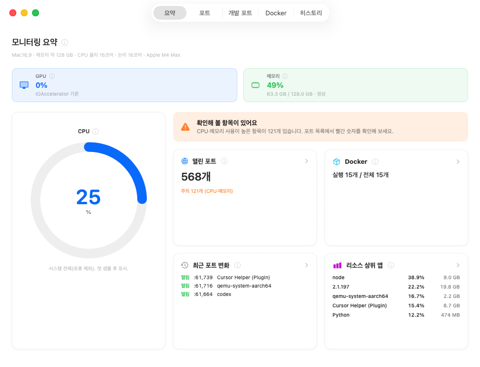
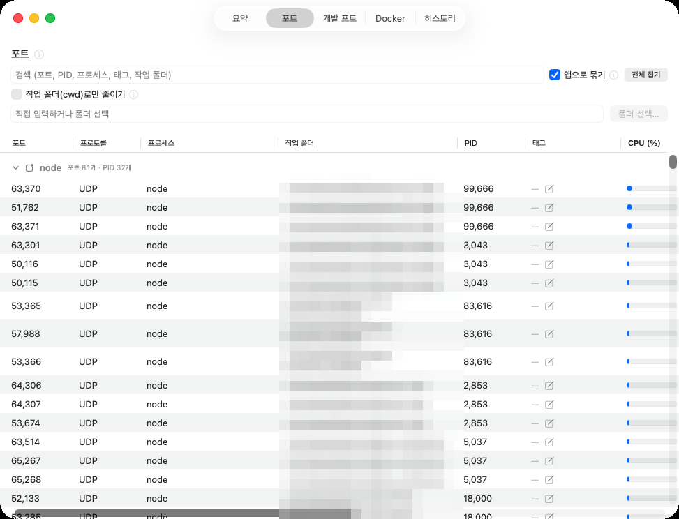
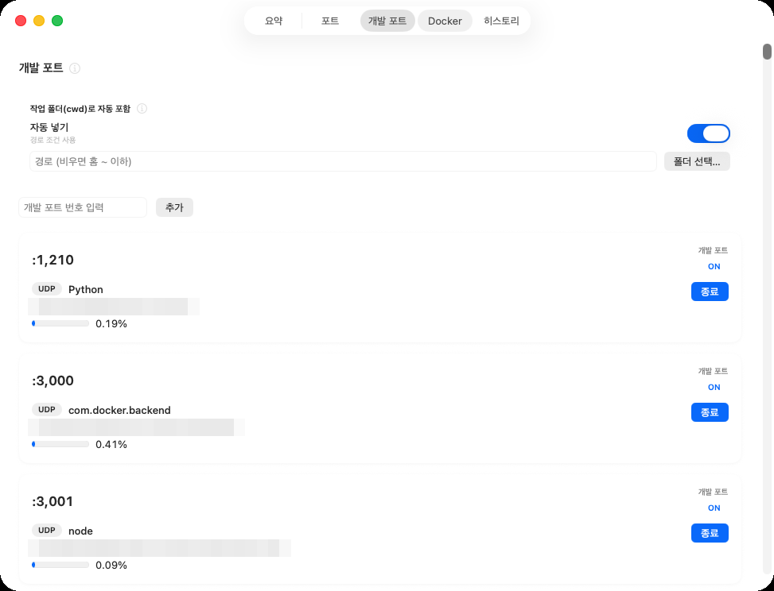
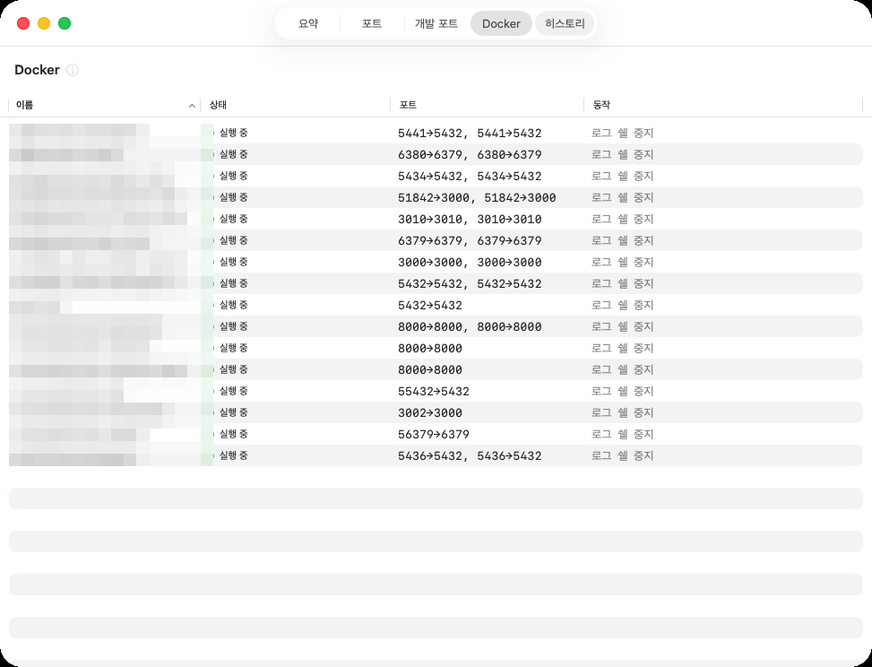
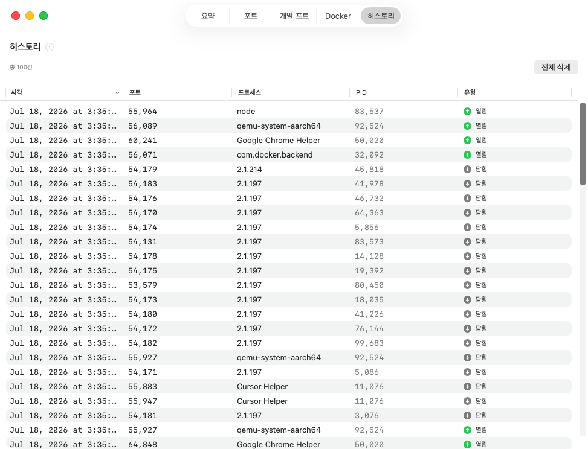

# PMON — Process Monitor for macOS

<p align="center">
  
</p>

<p align="center">
  <a href="https://github.com/So-Yul-e/homebrew-pmon/releases"></a>
  
  
  
  
</p>

**터미널 없이** Mac에서 열린 포트와 프로세스를 한눈에 확인하는 메뉴바 앱입니다.

`lsof -i :3000`, `ps aux | grep`, `kill -9` … 개발하다 보면 하루에도 몇 번씩 치게 되는 명령들을
메뉴바 앱 하나로 대체합니다. 포트가 어떤 프로세스에 물려 있는지, 그 프로세스를 꺼도 되는지까지
초보자도 판단할 수 있게 보여주는 것이 목표입니다.

---

## 설치

```bash
brew install --cask so-yul-e/pmon/pmon
```

| | |
|---|---|
| 업데이트 | `brew upgrade --cask pmon` |
| 삭제 | `brew uninstall --cask pmon && brew untap So-Yul-e/pmon` |
| 요구 사항 | macOS 13.0 Ventura 이상 |

---

## 주요 기능

### 요약(대시보드)
- Mac 전체 CPU / GPU / 메모리 상태를 한눈에 확인
- 리소스 상위 앱(Top resource apps) 빠른 트리아주
- CPU·메모리 사용이 높은 항목을 한 문장으로 안내

### 포트 모니터
- 현재 열린 모든 TCP/UDP 포트를 프로세스 이름, PID, 작업 폴더와 함께 표시
- 포트 번호 / 프로세스 이름 / PID / 태그 / 작업 폴더로 검색·필터
- 프로세스별 CPU · 메모리 사용량 실시간 표시 — 활성 상태 보기(Activity Monitor)와 동일한 기준(1코어 = 100%)
- CPU·메모리 임계값 초과 프로세스 강조 표시
- 동일 프로세스의 여러 포트 묶어 보기(접기/펼치기)
- **종료 안전도 신호등**: 이 프로세스를 꺼도 되는지 초보자도 판단할 수 있게 표시

### 개발 포트
- 개발 서버 포트만 모아 보는 전용 탭 — 작업 폴더(cwd) 기준 자동 추적 + 수동 등록
- "끄는 걸 잊은 개발 서버"를 찾아내는 용도

### 포트 태그 · 히스토리 · 알림
- PostgreSQL, Redis, MySQL, HTTP, SSH 등 잘 알려진 포트 자동 태그 + 포트별 커스텀 태그(재시작 후에도 유지)
- 포트 열림/닫힘 이벤트 실시간 기록 (최근 100개)
- 감시 포트 등록 시 열림/닫힘 macOS 알림

### Docker 통합
- Docker Engine API로 실행 중인 컨테이너와 포트 바인딩 목록 표시
- 컨테이너 로그 실시간 스트리밍, 컨테이너 내부 인터랙티브 셸, 확인 후 중지

### 메뉴바 상주
- 메인 창을 닫아도 메뉴바에서 모니터링 계속 — 열린 포트 수 즉시 확인

---

## 스크린샷

| 포트 모니터 | 개발 포트 |
|---|---|
|  |  |

| Docker | 히스토리 |
|---|---|
|  |  |

---

## 기술 하이라이트

> 소스 코드는 비공개 저장소로 운영 중입니다. 아래는 설계 요약입니다.

- **Zero-shell 핫패스** — 포트/프로세스 폴링 루프는 `libproc` 네이티브 C API만 사용합니다. 주기 갱신 경로에서 서브프로세스(`lsof` 등)를 일절 생성하지 않아, 모니터링 앱 자신이 시스템 부하가 되지 않습니다.
- **콜드패스는 실용주의로** — Docker 연동은 사용자 액션 시에만 동작하는 콜드패스로 분리. `URLSession`이 Unix domain socket을 지원하지 않아 Docker Engine API 통신은 `curl` 트랜스포트로, exec TTY 세션은 `docker` CLI로 처리합니다.
- **크래시-세이프 로그 스트리밍** — Docker 멀티플렉스 로그 프레임(8바이트 헤더)을 경계 안전하게 파싱하고, 스트림 끊김을 우아하게 복구합니다.
- **Actor 기반 동시성** — `PortMonitorService`, `DockerSocketClient` 등 서비스 계층은 Swift `actor`로 격리해 데이터 레이스를 차단합니다.
- **서드파티 런타임 의존성 0** — SwiftUI + 시스템 프레임워크만으로 구성.
- **Activity Monitor 규약 준수** — CPU %는 1코어 = 100% 기준(멀티스레드 프로세스는 100% 초과 가능)으로, 사용자가 이미 아는 숫자와 어긋나지 않습니다.

### 아키텍처

```
┌─────────────────────────────────┐
│           UI Layer              │
│  MenuBar · Dashboard · PortList │
│  Servers · Docker · History     │
│  LogViewer · Shell · Settings   │
└──────────────┬──────────────────┘
┌──────────────▼──────────────────┐
│        ViewModel Layer          │
│  PortMonitor · Docker           │
│  History · TrackedServerPorts   │
└──────────────┬──────────────────┘
┌──────────────▼──────────────────┐
│         Service Layer (actor)   │
│  PortMonitor · ProcessManager   │
│  DockerSocket · LogStream       │
│  PortHistory · PortTag          │
└──────────────┬──────────────────┘
┌──────────────▼──────────────────┐
│          Data Layer             │
│  LibprocBridge (C API)          │
│  Host*Reader (CPU/GPU/Memory)   │
│  DockerCurlTransport (curl +    │
│    Unix socket) · DockerShell   │
│  PMONSettings · UserDefaults    │
└─────────────────────────────────┘
```

---

## 링크

- 릴리즈(다운로드): https://github.com/So-Yul-e/homebrew-pmon/releases
- 소스 코드: 현재 비공개(Private) 저장소로 운영 중입니다.
